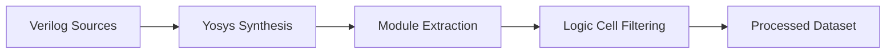
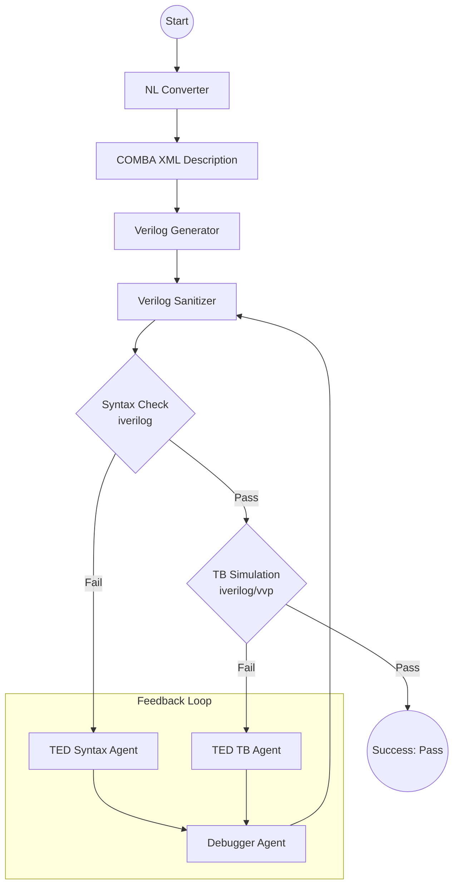

# GNU_COMBA: LLM-based Verilog Evaluation Framework

GNU_COMBA is a comprehensive framework designed for evaluating and benchmarking Large Language Models (LLMs) in the task of Verilog hardware description language generation. It builds upon `VerilogEval` and provides a structured environment for inference, assessment, and experimentation with various LLM providers.

## Key Features

- **Multi-Provider Support**: Supports inference via `llamacpp`, `openai` (and compatible APIs like vLLM), and more.
- **Automated Benchmarking**: Integrated with `VerilogEval` for standardized assessments.
- **Customizable Inference**: Fine-tune parameters like temperature, max tokens, number of samples, and in-context learning (ICL) examples.
- **Modular Flow System**: A flexible execution engine (`flow_src`) for complex processing pipelines.
- **Local Model Serving**: Scripts and configurations for serving models using vLLM.
- **Jupyter Integration**: Easy access to research and development notebooks.

## Pipeline Dataflows

GNU_COMBA implements several specialized dataflows for hardware description processing and LLM-driven generation.

### Pipeline 1: Synthesis & Dataset Extraction (Yosys Flow)

Used for processing existing Verilog codebases to extract training or evaluation datasets.



1.  **Synthesis**: Uses Yosys to parse and synthesize Verilog source files into a standardized gate-level or intermediate representation.
2.  **Extraction**: Identifies and extracts individual modules or sub-circuits based on complexity metrics (e.g., logic cell counts).
3.  **Filtering**: Applies filters to ensure the extracted modules meet specific criteria (e.g., minimum logic complexity, no unsupported primitives).

### Pipeline 3: LangGraph Multi-Agent Verification (LLM Flow)

A sophisticated, iterative agentic workflow using LangGraph to ensure generated Verilog is both syntactically correct and functionally accurate.



1.  **NL Converter**: Translates natural language requirements into a structured **COMBA XML** description.
2.  **Verilog Generator**: Produces initial Verilog code from the XML specification.
3.  **Verilog Sanitizer**: Extracts pure Verilog code from LLM response noise and auto-fixes trivial formatting issues.
4.  **Syntax Check (SC)**: Performs rapid syntax validation using `iverilog --lint-only`.
5.  **TED Syntax Agent**: Parses `iverilog` logs to identify the "Topmost Exception" and provide structured feedback.
6.  **TB Simulation (TS)**: Executes functional verification against benchmark testbenches.
7.  **TED TB Agent**: Parses simulation traces to identify functional bugs.
8.  **Debugger Agent**: Unified correction agent that uses feedback from TED agents to iteratively refactor the Verilog code.

- **Isolated Execution**: Every sample runs in an independent, isolated `work_dir`, preventing file collisions and race conditions during parallel execution.
- **Precise Error Parsing**: Standardized `iverilog` parsing filters out warnings and non-critical noise, allowing agents to focus exclusively on syntax errors.
- **Hierarchical Self-Consistency**: Multi-sample Best-of-N strategy. Tier 1 (deterministic) for speed, Tier 2 (diverse sampling with hints) for robustness.
- **Token Efficiency**: Automated truncation of task descriptions in the debugger node to minimize context window overhead and save tokens.
- **Description Flexibility**: Support for raw `.txt` input, bypassing the XML converter for users who prefer direct text-to-Verilog generation.

---

## Project Structure

- `src/`: Core Python source code for inference and processing.
- `src/flow_src`: Experimental modular flow system.
- `ext/`: External dependencies and submodules (e.g., `VerilogEval`).
- `utils/`: Helper scripts and utilities.
- `configure.ac` & `Makefile.in`: Autotools-based build system for managing experiments.
- `environment.yaml`: Conda environment specification.

## Setup

### 1. Clone Submodules

```bash
git submodule update --init --recursive
```

### 2. Environment Setup

It is recommended to use the provided Conda environment:

```bash
conda env create -f environment.yaml
conda activate gnu_comba
```

### 3. Install Icarus Verilog

GNU_COMBA uses **Icarus Verilog (`iverilog`)** version 12 (stable) for both syntax checking and functional testbench simulation. Follow the instructions in the `ext/verilog-eval` repository to install it.

## Usage Guide

GNU_COMBA uses a `configure` and `make` system to manage different evaluation runs.

### Basic Workflow

**Pipeline 1 (Synthesis & Dataset Extraction)**

Used for processing Verilog codebases to extract specific modules based on complexity.

1. **Create & enter build directory**:
   ```bash
   mkdir -p build_pipeline1
   cd build_pipeline1
   ```
2. **Configure the extraction parameters**:
   ```bash
   ../configure --with-yosys-path=/home/share/oss-cad-suite/bin/yosys \
                --with-cell-range-start=6 --with-cell-range-stop=10 \
                --with-flow-steps=synthesis,extract,filter
   ```
3. **Run the data-flow pipeline**:
   ```bash
   make data-flow
   ```

> [!TIP]
> **Synthesis Cache Completeness:** The extraction step depends on the `.cache_count_num_cell_2` directory. Ensure synthesis has been run for the entire dataset to achieve the expected module counts (e.g., ~85k for the 6-10 range). Extracting with a partial cache will result in proportional subset sizes.

**.config Reference (Pipeline 1)**
- `--with-yosys-path`: Path to the Yosys binary for hardware synthesis.
- `--with-cell-range-start/stop`: Defines the logic complexity (cell count) range for module extraction.
- `--with-flow-steps`: Comma-separated list of actions (`synthesis`, `extract`, `filter`).
- `--with-temp-dir`: Temporary directory for synthesis intermediate files.

---

**Pipeline 2 (Standard Single-Model Inference)**

1. **Create & enter build directory**:
   ```bash
   mkdir -p VE_testbench/generator/.build_sample_e0_t0
   cd VE_testbench/generator/.build_sample_e0_t0
   ```
2. **Configure the experiment**:
   ```bash
   ../../../configure --with-provider=openai --with-model=generator \
                      --with-temperature=0 --with-samples=1 --with-examples=0 \
                      --with-model-manual=http://localhost:8000/v1 \
                      --with-task=code-complete-iccad2023
   ```
3. **Run inference**:
   ```bash
   make
   ```
4. **Evaluate results**:
   ```bash
   make verilog-eval
   make -j 20
   ```

**.config Reference (Pipeline 2)**
- `--with-provider`: Inference engine (`openai`, `llamacpp`).
- `--with-model`: The name or path of the primary LLM.
- `--with-temperature`: Creativity vs. precision (0.0 for deterministic).
- `--with-samples`: Number of independent code samples to generate per problem.
- `--with-task`: Benchmark dataset (`code-complete-iccad2023`).

---

**Pipeline 3 (LangGraph Dual-GPU Multi-Agent Inference)**

1. **Create & enter build directory**:
   ```bash
   mkdir -p VE_testbench/langgraph/.build_sample_e0_t0
   cd VE_testbench/langgraph/.build_sample_e0_t0
   ```
2. **Configure with dual-GPU endpoints**:
   ```bash
   ../../../configure --with-provider=openai --with-model=generator \
                      --with-temperature=0 --with-samples=1 --with-examples=0 \
                      --with-model-manual=http://localhost:8000/v1 \
                      --with-model-submanual=http://localhost:8001/v1 \
                      --with-task=code-complete-iccad2023
   ```
3. **Run LangGraph inference** (spawns 20 parallel workers):
   ```bash
   make langgraph
   ```

> **Result:** The pipeline will automatically simulate each sample using `iverilog` and display the final pass rate summary and problem list after completion.

**.config Reference (Pipeline 3)**
- `--with-model-manual`: URL for the **Generator** LLM endpoint.
- `--with-model-submanual`: URL for the **Debugger** LLM endpoint (for Dual GPU setups).
- `--with-max-syntax-trials`: Maximum iterations allowed for syntax correction (default: 10).
- `--with-max-tb-trials`: Maximum iterations allowed for functional/testbench correction (default: 5).
- `--with-max_token`: Limit for the generated Verilog code output.
- `--with-quiet`: Only show progress bar during LangGraph inference (default: True).
- `--with-description-type`: (Batch mode) Specify `xml` or `txt` for processing design descriptions.
- `--with-self-consistency`: Enable Best-of-N multi-sampling (default: 0).
- `--with-max-samples`: Max samples for self-consistency (default: 5).

> [!IMPORTANT]
> **TXT Description Mode:** When using `LANGGRAPH_DESC=txt` (or `--desc-type txt`), the pipeline skips the XML conversion stage and passes the raw text specification directly to the generator. This is useful for benchmarks where the LLM performs better on raw problem statements.

> **Note:** To clean a build directory before re-running:
> ```bash
> cd <your_build_directory>  # e.g., VE_testbench/langgraph/.build_sample_e0_t0
> rm -rf *
> ```

---

**RTLLM Benchmark (Verilator Mode)**

RTLLM modules use C++ testbenches and require **Verilator** for simulation instead of Icarus Verilog.

1. **Verify Prerequisites**:
   - Ensure `verilator` is installed (`verilator --version`).
   - Use the `kim_VE` conda environment.

2. **Run Full Benchmark**:
   ```bash
   make RTLLM
   ```
   This command executes Pipeline 3 on the RTLLM dataset (found in `RTLLM/modules`) with 5 trials per design and saves aggregated reports to `RTLLM/reports/fixrate`.

   > [!NOTE]
   > **Estimated Runtime**: Completion typically takes **20–40 minutes** for the full suite (30 designs × 5 trials) when using the default 20 parallel workers.

3. **Targeted Testing**:
   To test specific designs or change trial counts:
   ```bash
   python3 benchmark_langgraph.py --dataset rtllm --trials 1 --designs JC_counter,FIFO_8bit
   ```

**Technical Integration:**
- **Verilator Integration**: The pipeline automatically detects `tb.cpp` in the module directory and switches to the Verilator build flow (`verilator --cc --exe --build`).
- **Waveform Tracing**: Automated VCD generation via the `--trace` flag is enabled for all RTLLM runs.
- **Dynamic Dataset Pathing**: Supports module-local testbench lookups via the `dataset_dir` state variable.

---

**Pipeline 4 (Model Fine-Tuning - Unsloth)**

Support for rapid LLM fine-tuning (e.g., base generator and debugger models) is facilitated via `unsloth`, allowing multi-quantized training on combined specific HDL datasets.
- Uses `SFTTrainer` combining Pipeline 1 indices (`train_index2_*.npy` & `Pyranet_text_only.jsonl`) with base benchmarks (e.g., `VE_text_156.jsonl`).
- Managed through dedicated `train_auto.py` and `train_debugger.py` driver scripts.


**1. Standard Inference (Pipeline 2 - Using `make`)**
Common setup configurations use the `eX_tY` naming convention (e: examples, t: temperature). This is the default execution flow for a single model:

- **`e0_t0`**: Zero-shot without examples + Greedy Search (1 sample).
  ```bash
  ../../../configure --with-provider=openai --with-model=generator --with-max_token=4096 --with-temperature=0 --with-samples=1 --with-examples=0 --with-model-manual=http://localhost:8000/v1 --with-task=code-complete-iccad2023
  ```
- **`e0_t8`**: Zero-shot without examples + Temperature 0.8 (generates 20 samples).
  ```bash
  ../../../configure --with-provider=openai --with-model=generator --with-max_token=4096 --with-temperature=0.8 --with-samples=20 --with-examples=0 --with-model-manual=http://localhost:8000/v1 --with-task=code-complete-iccad2023
  ```
- **`e1_t0`**: One-shot with 1 example + Greedy Search.
  ```bash
  ../../../configure --with-provider=openai --with-model=generator --with-max_token=4096 --with-temperature=0 --with-samples=1 --with-examples=1 --with-model-manual=http://localhost:8000/v1 --with-task=code-complete-iccad2023
  ```
- **`e1_t8`**: One-shot with 1 example + Temperature 0.8 (generates 20 samples).
  ```bash
  ../../../configure --with-provider=openai --with-model=generator --with-max_token=4096 --with-temperature=0.8 --with-samples=20 --with-examples=1 --with-model-manual=http://localhost:8000/v1 --with-task=code-complete-iccad2023
  ```


**2. Multi-Agent Inference with LangGraph (Pipeline 3 - Using `make langgraph`)**
In this Multi-Agent setup, both generator and debugger models are used simultaneously. The pipeline automatically performs iterative error correction using LLM-driven feedback.

**Key features:**
- **Automatic Renaming**: The pipeline automatically renames the generated module to `TopModule` in the simulation stage to satisfy `VerilogEval` testbench requirements.
- **Iverilog Simulation**: Uses `iverilog` and `vvp` to provide precise functional feedback to the debugger agent.
- **Dual GPU Routing**: Explicitly declare the Debugger URL (`--with-model-submanual`) to route tasks correctly between the two GPUs.

- **Dual GPU LangGraph**: Routes Generation tasks to port 8000 and Debugger evaluation tasks to port 8001.
  
  ```bash
  ../../../configure --with-provider=openai --with-model=generator --with-max_token=4096 \
                     --with-temperature=0 --with-samples=1 --with-examples=0 \
                     --with-model-manual=http://localhost:8000/v1 \
                     --with-model-submanual=http://localhost:8001/v1 \
                     --with-task=code-complete-iccad2023 --with-quiet=True
  ```

  ```bash
  ../../../configure --with-provider=openai --with-model=generator --with-max_token=4096 \
                     --with-temperature=0.8 --with-samples=20 --with-examples=1 \
                     --with-model-manual=http://localhost:8000/v1 \
                     --with-model-submanual=http://localhost:8001/v1 \
                     --with-task=code-complete-iccad2023 --with-quiet=True
  ```


- `--with-provider`: LLM provider (`llamacpp`, `openai`, etc.).
- `--with-model`: Name or path of the model.
- `--with-max_token`: Maximum number of output tokens.
- `--with-temperature`: Creativity vs. precision (0.0 for deterministic).
- `--with-samples`: Number of independent code samples to generate per problem.
- `--with-examples`: Number of ICL examples to include in the prompt.
- `--with-task`: Benchmark dataset (`code-complete-iccad2023` or `spec-to-rtl`).- `--with-model-manual`: Base URL for the primary model (e.g., generator).
- `--with-model-submanual`: Base URL for the sub-model (e.g., debugger).
- `--with-max-syntax-trials`: Max syntax correction attempts (default: 10).
- `--with-max-tb-trials`: Max testbench debugging attempts (default: 5).
- `--with-quiet`: Control verbosity of LangGraph inference output (True/False).
- `--with-description-type`: Input description format for Pipeline 3 (xml or txt).


### Local Model Serving (Dual GPU)

You can serve the base model and debugger model locally on a dual-GPU setup using the provided utility:

```bash
# Start the dual instances (Generator on 8000, Debugger on 8001)
./launch_dual_gpu.sh

# Stop the servers
./launch_dual_gpu.sh --stop

# Check status
./launch_dual_gpu.sh --status
```

## Make Target Reference

### Inference & Benchmarks
- **`make langgraph`**: Run Pipeline 3 (LangGraph) on the **VerilogEval V1** dataset. This is the main target for spec-to-RTL agentic inference.
- **`make langgraph-veval-v2`**: Run Pipeline 3 on the **VerilogEval V2** (spec-to-rtl) dataset.
- **`make RTLLM`**: Run Pipeline 3 on the **RTLLM** dataset (uses Verilator by default).
- **`make VerilogEval-bench`**: Run the legacy benchmark script for VerilogEval (calls `benchmark_langgraph.py`).
- **`make default`**: Run standard non-agentic LLM inference (Pipeline 2).

### Data Preparation (Pipeline 1)
- **`make data-flow`**: Execute the full extraction pipeline (synthesis, extract, filter).
- **`make synthesis`**: Run only the Yosys synthesis step.
- **`make extract`**: Extract sub-modules from synthesized netlists.
- **`make filter`**: Filter extracted modules by cell count/complexity.

### Analysis & Debugging
- **`make analyze-syntax`**: Run the self-consistency analyzer for all benchmarks (requires `SC=1`).
- **`make analyze-enum`**: Specifically detect port/enum mismatch issues in RTLLM generations.
- **`make jupyterlab`**: Launch a Jupyter Lab instance for interactive development.

### Maintenance
- **`make help`**: Display all available targets and their default configurations.
- **`make clean`**: Remove build artifacts and temporary files.

---

## Edit configure.ac (Autoconfig)

To add new configuration parameters (e.g., `--with-my-param`):
1. Open `configure.ac`.
2. Add a new `AC_ARG_WITH` block and `AC_SUBST([my_param])` for the parameter.
3. Open `Makefile.in` and use `@my_param@` wherever you need the variable.
4. Run `autoreconf -fi` in the root directory to regenerate the `configure` script.
5. Re-run your `../configure ...` command to apply.

## Development

To start a Jupyter Lab instance in the source directory:

```bash
make jupyterlab
```

---
Maintainer: Vu-Minh-Thanh Nguyen (nvmthanh@hcmus.edu.vn), Ngoc-Thien-Kim Nguyen (nntkim.work@gmail.com)
Version: 2.4.0
