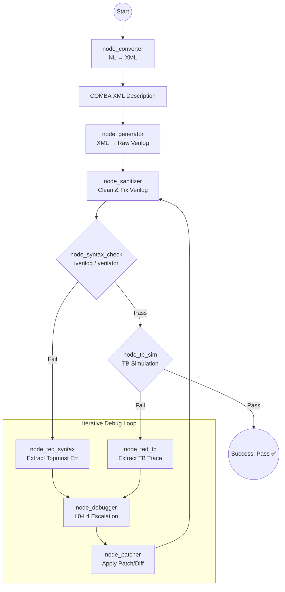

# COMBA-PROMPT LangGraph Core

The `langgraph_core` directory contains the LangGraph-based implementation of the COMBA-PROMPT Full Verification Pipeline. This pipeline orchestrates a multi-agent iterative workflow that takes a Natural Language (NL) description of a Verilog module, converts it into structured XML, generates the initial Verilog code, and repeatedly syntax-checks and simulates it, utilizing LLMs to automatically debug and patch issues until the design is flawless or reaches a configurable trial limit.

---

## 🏗️ Core Architecture & Nodes

The pipeline utilizes **LangGraph** to model the execution states and conditional routing. Currently, it implements up to 9 distinct nodes orchestrated sequentially and recursively:

1. **`node_converter` (NL → XML):**
   Transcribes the initial unstructured natural language requirements into a tightly structured `COMBA XML` format. Validates that the core module definition and ports are intact.

2. **`node_generator` (XML → Raw LLM Output):**
   Consumes the XML and original constraints, instructing the base LLM to generate the initial Synthesizable Verilog Description (GVD).

3. **`node_sanitizer` (Raw Text → Clean Verilog):**
   Processes the raw LLM output using `VerilogSanitizer`, cleanly extracting the Verilog code from Markdown blocks, auto-fixing trivial syntax omissions (like missing semicolons or trailing commas), and emitting normalized code.

4. **`node_syntax_check` (Syntax Check):**
   Invokes the compiler (`iverilog` via `-tnull` or `verilator --lint-only`) to perform a strict syntax and linting check on the sanitized Verilog code.

5. **`node_ted_syntax` (Topmost Exception Detection - Syntax Check):**
   If syntax errors occur, this node extracts the *topmost* error. It queries the **EDTM** (Exception-Debugging Trial Management) system to prevent infinite looping over the same unresolvable error, and prepares an **EDP** (Exception Debugging Prompt).

6. **`node_debugger` / `node_correcter`:**
   Invokes the LLM to fix the codebase. In v3, it uses a `MultiAttemptManager` for *escalating* prompt strictness (L0 to L4) based on how many times an error-key has been seen.

7. **`node_patcher`:**
   Safely applies JSON-based diff patches (or fuzzy matches substitution) returned by the debugger exactly where the issue lies, avoiding regenerating entire large modules.

8. **`node_tb_sim` (Testbench Simulation):**
   If the syntax check passes without errors, the state routes here. This node compiles the design thoroughly alongside the provided reference and testbench files and performs simulation.

9. **`node_ted_tb` (Topmost Exception Detection - TB):**
   If testbench assertions fail (Trace mismatches), it extracts the Topmost TB Failure trace and formulates a **TDP** (Testbench Debugging Prompt) to route back to the Debugger.

### Pipeline Flow Graph

---

## 🧠 Prompts Structure (`prompts.py`)

All LLM instruction definitions are centralized in `prompts.py`. The prompts enforce extreme rigor natively expected of Hardware Description Languages.

* **CONVERTER\_SYSTEM\_PROMPT**: Enforces the translation of text specs to COMBA XML. Strictly preserves module IDs and instructs the LLM not to "hallucinate" implementation-specific registers if not natively specified.
  * *COMBA XML Schema Rules:*
    1. `<module id="name">` — root
    2. `<description>` — high-level summary
    3. `<ports>` containing `<input>` / `<output>` with optional `width_description`
    4. `<parameter_description>` (optional) — FSM states, named constants ONLY.
    5. `<logic_description>` (optional) — signal-level typed assignments (`sequential_logic` / `combinational_logic`).
    6. `<implementation>` — detailed behavior (inline behavioral description only).
    7. `<task>` (optional)
* **GENERATOR\_SYSTEM\_PROMPT**: Implements critical Verilog conventions:
  * **Self-Contained Rule**: No external sub-modules. Everything must be implemented inline.
  * **Assignment Discipline**: Blocking `=` for combinational, non-blocking `<=` for sequential.
  * **Shift & ALU restrictions**: Disallows variable bit-select range bounds (e.g. `signal[H:L+i]`) in favor of indexed part-select (`signal[N*i +: W]`). Denies hacky concatenation for shift operations.
* **EDP\_SYSTEM\_PROMPT & USER\_PROMPT (Syntax Debugging)**: Automatically maps extracted Verilator/Icarus errors directly to strict fixes (e.g., `BLKANDNBLK` → "Separate into comb and seq blocks").
* **TDP\_SYSTEM\_PROMPT & USER\_PROMPT (Functional Debugging)**: Employs dynamic Trace comparison. Includes advanced **Hint Injection**—if the testbench detects an unused port out of the module definition, it appends a critical hint directly forcing the LLM to apply logic to that unused port.

---

## ⚙️ Key Advanced Mechanics

### EDTM (Exception-Debugging Trial Management)

Tracks the exact signature of compiler and testbench errors across loop iterations. If the pipeline attempts to resolve `Error X` more than `EDTM_MAX_RETRIES` times (e.g. 3) and fails, the prompt forcefully flags the exception as unresolvable by naive changes and escalates the approach.

### Rollback Manager

Tracks the exception count per iteration in a snapshot history (`sgvd_versions`). If a debugger's attempted fix *introduces more* errors into the code than previously existed, the pipeline cancels the generated text and rolls back to the prior known best-state.

### Multi-Attempt Escalation (`multi_attempt.py`)

The pipeline doesn't just ask the LLM repeatedly. It tracks the failure level using a `MultiAttemptManager`:

* **L0**: Gentle hint (Standard retry).
* **L1**: Explicit constraint injection (Port preservation, assignment rules).
* **L2**: Forced block rewrite (Directs LLM to discard and replace a specific logic block).
* **L3 / L4**: High hostility / Architecture rollback (Forces a fundamental rethink or reverts to a prior known state).

### Hierarchical Self-Consistency (`multi_sample.py`)

To further boost the pass rate, the pipeline implements a **Best-of-N Self-Consistency** strategy:

*   **Tier 1 (Deterministic Baseline)**: Runs a single sample at `Temperature=0.0`. If this sample passes all tests, the pipeline exits early to save tokens and time.
*   **Tier 2 (Diversity Sampling)**: If Tier 1 fails, the pipeline spawns up to `N-1` additional independent parallel samples at increasing temperatures (e.g., 0.5 to 1.0).
*   **Diversity Hints**: For Tier 2 samples, the generator is injected with unique "Diversity Hints" (e.g., "Try a case statement instead of if-else") to explore different architectural solutions.
*   **Scoring & Selection**: Each finished sample is scored by `(Status, -TB_Errors, -SC_Errors, -Code_Size)`. The best-performing sample is selected as the final result.

---

## 🔌 LLM Interface Routing (`llm_interface.py`)

Custom LangChain `BaseChatModel` wrapper specifically built for **dual-GPU asynchronous processing**:

* `switch_to_base()`: Routes `Converter` and `Generator` tasks to the **Base Model** (e.g., hosted on `:8000`), optimizing for structural generation.
* `switch_to_lora()`: Routes debugging prompts to the **Debugger LoRA-adapted Model** (e.g., hosted on `:8001`), optimizing for pinpoint Verilog bug fixing.

Can safely fall back to standard `ChatOpenAI`/`Ollama` endpoints via `.env` definitions.

---

## 🚀 Execution & Serving

The core entry point utilities are within `pipeline_runner.py`:

* `run_pipeline_sync()`: Invokes a single module prompt run until resolution or limit. Automatically dispatches to `multi_sample` if self-consistency is enabled.
* `run_pipeline_streaming()`: Generates an event-driven stream yielding the node and current graphical state per jump (used in UI/API connections).
* `run_pipeline_batch()`: Executes over directories of descriptions and outputs aggregated markdown (`summary_langgraph.md`) and JSON reports tracking Pass Rates, Avg trials, and BoN (Best-of-N) statistics.
