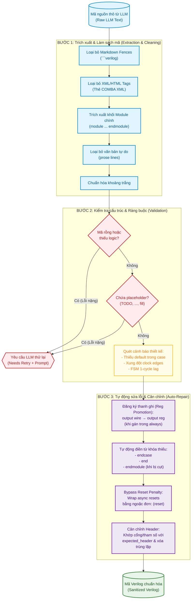

# Tài liệu Flowcharts - GNU COMBA Pipeline

Tài liệu này mô tả chi tiết quy trình xử lý và làm sạch dữ liệu trong hai giai đoạn quan trọng của hệ thống:
1. **Mục 3.3.1: Quy trình lọc dữ liệu (corpus) Pyranet** sử dụng Yosys và phân tích thuộc tính phần cứng.
2. **Mục 3.5: Quy trình lọc và làm sạch mã nguồn (Sanitizer) 3 bước** cho mã nguồn Verilog được sinh ra từ mô hình ngôn ngữ lớn (LLM).

---

## 📌 Mục 3.3.1 — Quy trình lọc corpus Pyranet

Quy trình này lọc tập dữ liệu thô từ `bnadimi/PyraNet-Verilog` nhằm chọn lọc các mẫu có độ phức tạp phù hợp và loại bỏ các thiết kế không chứa logic thực tế hoặc lỗi cú pháp nặng. Quy trình gồm 3 giai đoạn chính:

1. **Tổng hợp và kiểm tra cú pháp (Synthesis & Cache):**
   - Đọc từng thiết kế Verilog từ dataset gốc.
   - Gọi công cụ **Yosys** thông qua bộ phân tích cú pháp **slang** (`yosys -m slang -p 'read_slang top.v; hierarchy -simcheck -auto-top; tee -o out.json stat -json'`).
   - Giới hạn tài nguyên (MemoryMax=2G, thời gian timeout 300 giây) thông qua `systemd-run` để tránh rò rỉ tài nguyên.
   - Trích xuất tổng số lượng ô logic (cell count) từ tệp `out.json`. Nếu gặp lỗi cú pháp hoặc timeout, ghi nhận là `None`.
   - Kết quả được cache lại dưới dạng tệp văn bản cục bộ trong thư mục `.cache_count_num_cell_2/`.

2. **Lọc theo độ phức tạp tài nguyên (Range Selection):**
   - Đọc toàn bộ các tệp kết quả từ cache.
   - Loại bỏ các phần tử bị lỗi cú pháp (`None`) hoặc bị timeout.
   - Lọc các mẫu thiết kế nằm trong khoảng số lượng ô logic mong muốn (mặc định là `[6, 10]`).
   - Ánh xạ lại chỉ số (global index) về dataset ban đầu và lưu dưới dạng mảng NumPy (`.npy`) trong thư mục `src/TrainDataset/`.

3. **Lọc loại bỏ mã không chứa logic (Logic Keyword Filtering):**
   - Sử dụng thư viện phân tích cú pháp (`module_extraction`) để xác định và loại bỏ toàn bộ chú thích (comments) trong mã nguồn Verilog.
   - Tìm kiếm các từ khóa đặc trưng của logic phần cứng như: `always`, `and`, `assign`, `not`, `nand`, `nor`, `or`, `xnor`, `xor`, `display`.
   - Các thiết kế không chứa bất kỳ từ khóa nào trong danh sách trên sẽ bị phân loại là "không chứa logic" (no-logic) và lập chỉ mục để loại bỏ khỏi tập huấn luyện cuối cùng.

### Mermaid Flowchart: Quy trình lọc corpus Pyranet

```mermaid
graph TD
    %% Styling Definitions
    classDef stepClass fill:#e3f2fd,stroke:#1565c0,stroke-width:2px,color:#0d47a1;
    classDef checkClass fill:#fff3e0,stroke:#ef6c00,stroke-width:2px,color:#ef6c00;
    classDef dataClass fill:#efebe9,stroke:#4e342e,stroke-width:2px,color:#3e2723;
    classDef resultClass fill:#e8f5e9,stroke:#2e7d32,stroke-width:2px,color:#1b5a20;

    %% Data Input
    Input[("Dataset gốc:<br>bnadimi/PyraNet-Verilog")]:::dataClass

    subgraph Phase1 ["BƯỚC 1: Tổng hợp & Kiểm tra cú pháp (Yosys)"]
        WriteV["Ghi mã nguồn vào top.v<br>trong thư mục tạm"]:::stepClass
        RunYosys["Chạy Yosys với slang parser<br>(Giới hạn: 2GB RAM, 300s)"]:::stepClass
        CheckResult{"Kết quả tổng hợp<br>thành công?"}:::checkClass
        ExtractCells["Trích xuất tổng số cell<br>từ out.json"]:::stepClass
        CacheNull["Ghi nhận lỗi/timeout<br>(cell_count = None)"]:::stepClass
        CacheSuccess["Lưu (timeout=0, cell_count)<br>vào thư mục cache"]:::stepClass
    end

    subgraph Phase2 ["BƯỚC 2: Lọc theo độ phức tạp (Cell Range)"]
        ReadCache["Đọc thông tin từ cache<br>(.cache_count_num_cell_2/)"]:::stepClass
        FilterRange{"Số lượng Cell nằm trong<br>khoảng [cell_start, cell_stop]?"}:::checkClass
        MapIndex["Ánh xạ về chỉ số gốc<br>(Original Index)"]:::stepClass
        SaveNpy["Lưu danh sách chỉ số<br>(train_index2_start-stop.npy)"]:::dataClass
    end

    subgraph Phase3 ["BƯỚC 3: Loại bỏ mã không chứa logic (Logic Filter)"]
        StripComments["Loại bỏ chú thích (comments)<br>bằng module_extraction"]:::stepClass
        ScanKeywords{"Chứa từ khóa logic?<br>(always, assign, or, and, xor...)<br>sau khi bỏ comments?"}:::checkClass
        MarkNoLogic["Đánh dấu chỉ số<br>không chứa logic"]:::stepClass
        SaveNoLogic["Lưu chỉ số no-logic<br>(dataset_index_output.npy)"]:::dataClass
    end

    %% Final Outputs
    OutputDataset[("Tập dữ liệu huấn luyện<br>đã được làm sạch & chọn lọc")]:::resultClass

    %% Connections
    Input --> WriteV
    WriteV --> RunYosys
    RunYosys --> CheckResult
    CheckResult -- Thất bại / Timeout --> CacheNull
    CheckResult -- Thành công --> ExtractCells
    ExtractCells --> CacheSuccess

    CacheSuccess & CacheNull --> ReadCache
    ReadCache --> FilterRange
    FilterRange -- Không khớp / Lỗi --> Drop1[("Bỏ qua mẫu")]:::dataClass
    FilterRange -- Khớp (VD: 6-10 cells) --> MapIndex
    MapIndex --> SaveNpy

    SaveNpy --> StripComments
    StripComments --> ScanKeywords
    ScanKeywords -- Không có từ khóa --> MarkNoLogic
    ScanKeywords -- Có từ khóa --> OutputDataset
    MarkNoLogic --> SaveNoLogic
    SaveNoLogic --> Exclude[("Loại khỏi tập huấn luyện cuối")]:::dataClass

    %% Apply Classes
    class WriteV,RunYosys,ExtractCells,CacheNull,CacheSuccess,ReadCache,MapIndex,StripComments,MarkNoLogic stepClass;
    class CheckResult,FilterRange,ScanKeywords checkClass;
    class Input,SaveNpy,SaveNoLogic,Drop1,Exclude dataClass;
    class OutputDataset resultClass;
```



---

## 📌 Mục 3.5 — Quy trình 3 bước Sanitizer

Mã Verilog do LLM sinh ra thường chứa các thẻ định dạng, giải thích thừa thãi, hoặc thiếu các cấu trúc cơ bản. `verilog_sanitizer.py` áp dụng pipeline làm sạch nghiêm ngặt qua 3 bước để chuẩn hóa mã trước khi gửi đến trình kiểm tra cú pháp (Syntax Check/Lint):

1. **Bước 1: Trích xuất & Làm sạch mã nguồn (Extraction & Cleaning):**
   - Loại bỏ các khung mã Markdown (markdown fences: ````verilog ... ````).
   - Loại bỏ các thẻ định dạng XML/HTML (như `<module>`, `<ports>`, `<logic_description>`) được sinh ra trong cấu trúc XML của COMBA.
   - Định vị và trích xuất khối module chính bằng Regex: khớp từ khóa `module` với `endmodule` gần nhất.
   - Loại bỏ các dòng văn bản tự do (prose lines) không chứa ký tự cú pháp Verilog hoặc từ khóa định nghĩa phần cứng.
   - Loại bỏ khoảng trắng thừa để bình thường hóa cấu trúc mã.

2. **Bước 2: Kiểm tra cấu trúc & Ràng buộc (Structural Validation):**
   - Kiểm tra xem thiết kế có chứa từ khóa logic hoặc khai báo cổng hay không (ngăn lỗi mã rỗng).
   - Quét tìm và cảnh báo nếu phát hiện các chuỗi placeholder như `// TODO`, `...`, `your code here`.
   - Phát hiện các lỗi thiết kế phổ biến: câu lệnh `case` thiếu nhánh `default` (tạo latch không mong muốn), xung đột cạnh sườn của clock (sử dụng cả `posedge` và `negedge`), hoặc gán tín hiệu trong khối `always` tuần tự gây trễ 1 chu kỳ FSM.

3. **Bước 3: Tự động sửa lỗi & Cân chỉnh Header (Auto-Repair & Header Alignment):**
   - **Đăng ký thanh ghi (Reg Promotion):** Tự động chuyển đổi cổng ra `output wire` thành `output reg` nếu phát hiện tín hiệu đó được gán giá trị bên trong một khối `always` thủ tục.
   - **Bổ sung cú pháp thiếu:** Tự động điền các từ khóa `end`, `endcase`, hoặc `endmodule` bị thiếu do văn bản bị cắt cụt.
   - **Sửa cấu trúc điều kiện đơn dòng:** Bổ sung từ khóa `else` bị thiếu trong các mẫu lệnh rẽ nhánh ghi đè tín hiệu.
   - **Bỏ qua lỗi Reset không đồng bộ:** Bao bọc tín hiệu reset trong danh sách nhạy (sensitivity list) bằng dấu ngoặc đơn (ví dụ: `posedge (reset)`) để vượt qua các bộ kiểm tra cú pháp khắt khe của môi trường đánh giá.
   - **Cân chỉnh Header:** Buộc thay thế phần khai báo module bằng `expected_header` được định nghĩa trước đó và tự động lược bỏ các khai báo trùng lặp bên trong thân module.

### Mermaid Flowchart: 3 bước Sanitizer trong verilog_sanitizer.py


