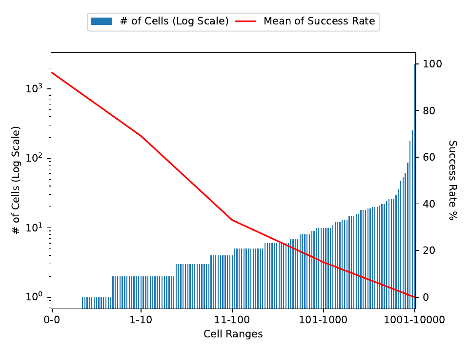

# Biểu đồ phân tích độ phức tạp thiết kế (VerilogEval)

Biểu đồ dưới đây được vẽ từ dữ liệu tích hợp của tập dữ liệu kiểm thử, thể hiện sự phân bổ thiết kế theo **Độ phức tạp của mạch phần cứng** (được đo bằng số lượng ô logic - logic cells tổng hợp qua Yosys).

---

## 📊 Biểu đồ trực quan

---

## 📝 Phân nhóm độ phức tạp thiết kế

Dữ liệu thiết kế được phân loại thành các nhóm dựa trên số lượng ô logic (cell count) thực tế để đánh giá quy mô thiết kế:

| Nhóm số lượng Cell (Logic Count Range) | Nhận xét / Phân tích quy mô mạch |
| :--- | :--- |
| **0** (Thiết kế thuần tổ hợp cực đơn giản) | Các mạch logic tổ hợp cơ bản, không có trạng thái tuần tự và không sử dụng clock. |
| **1 - 10** (Thiết kế nhỏ/FSM đơn giản) | Mạch bắt đầu xuất hiện các thành phần lưu trữ hoặc các FSM (Finite State Machine) nhỏ. |
| **11 - 100** (Độ phức tạp trung bình) | Mạch tích hợp nhiều đường truyền dữ liệu (datapath) và các khối điều khiển tuần tự phức tạp hơn. |
| **101 - 1000** (Độ phức tạp cao) | Thiết kế quy mô lớn, chứa nhiều module con hoặc các bus dữ liệu phức tạp. |
| **1001 - 10000** (Thiết kế cực lớn) | Các hệ thống số tích hợp quy mô lớn (SoC hoặc các lõi xử lý dữ liệu phức tạp). |

## 💡 Kết luận ứng dụng trong COMBA

1. **Ngưỡng phức tạp thiết kế:** Việc phân chia các nhóm cell giúp định vị rõ ràng các ngưỡng chuyển đổi độ phức tạp của mạch số.
2. **Vai trò của bộ lọc lọc corpus (Mục 3.3.1):**
   - Bộ lọc corpus giới hạn thiết kế trong khoảng **`[6, 10]`** ô logic (mục tiêu huấn luyện của Pyranet) nhằm tập trung vào vùng mạch có độ khó vừa phải, tránh các thiết kế quá đơn giản (0 cells) hoặc các thiết kế quá lớn gây quá tải trong quá trình fine-tuning.
3. **Vai trò của Sanitizer (Mục 3.5):**
   - Giúp nâng cao tính hợp lệ của mã nguồn Verilog được sinh ra cho tất cả các nhóm độ phức tạp bằng cách tự động chuẩn hóa cú pháp trước khi đưa vào trình mô phỏng hoặc tổng hợp.
